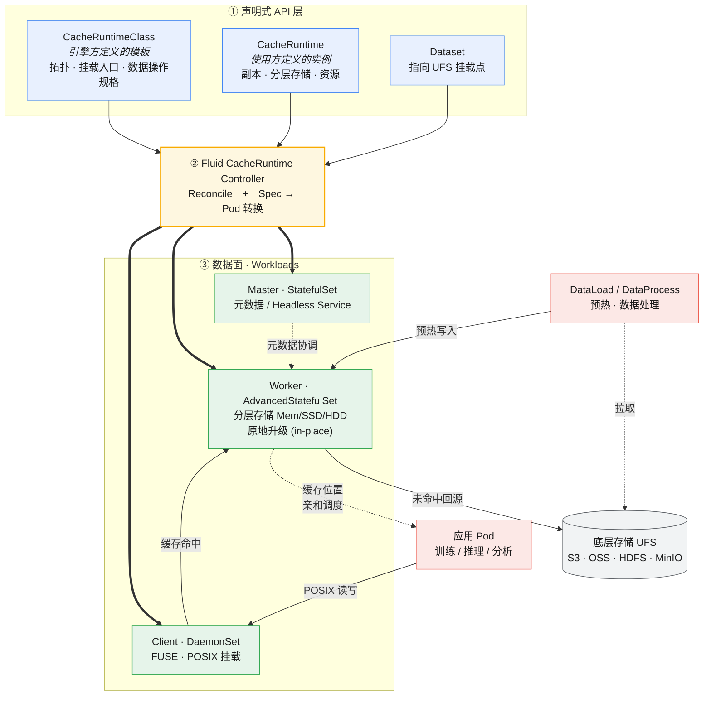

# Fluid CacheRuntime 架构图

下图展示 Fluid 1.1.0 **CacheRuntime 通用缓存引擎框架**的整体架构：从声明式 API（`CacheRuntimeClass` 模板 + `CacheRuntime` 实例 + `Dataset`），经由 Fluid 控制器 Reconcile 与「Spec → Pod」转换，编排出 Master / Worker / Client 三类组件，并打通应用 Pod → FUSE 客户端 → Worker 缓存 → 底层存储（UFS）的数据链路。

## 图例说明

| 层 | 角色 | 说明 |
| --- | --- | --- |
| **① 声明式 API** | `CacheRuntimeClass` | 由**引擎/平台方**定义一次的模板：文件系统类型、组件拓扑、UFS 挂载与状态上报入口、数据操作规格 |
| | `CacheRuntime` | 由**使用方**创建的实例：引用某个 Class，填入副本数、分层存储、资源等运行时参数 |
| | `Dataset` | 声明底层存储挂载点与访问凭据，与 CacheRuntime 绑定 |
| **② 控制面** | CacheRuntime Controller | Reconcile 上述 CRD，并将 Spec 声明式转换为各组件工作负载；最小权限 RBAC |
| **③ 数据面** | Master | 元数据与协调，StatefulSet + Headless Service |
| | Worker | 缓存数据存储，AdvancedStatefulSet 支持原地升级；支持内存/SSD/HDD 分层存储 |
| | Client | FUSE 客户端，DaemonSet 形式提供 POSIX 挂载 |
| **数据链路** | App → Client → Worker → UFS | 应用经 FUSE 读写，命中走 Worker 缓存，未命中回源 UFS；缓存位置信息用于数据亲和调度 |
| | DataLoad / DataProcess | 将 UFS 数据预热进 Worker 缓存或执行数据处理 |

> 本图为 Mermaid 源码，可在 GitHub、VS Code、mermaid.live 等直接渲染，也可导出为 SVG/PNG 作为文章配图。
