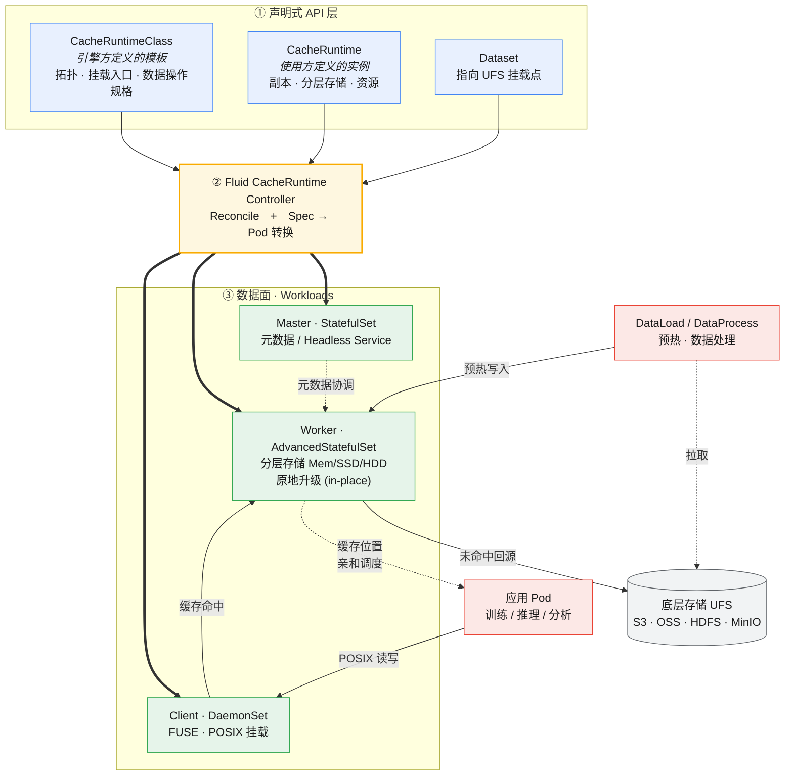

# 深度解读 Fluid 1.1.0：以 CacheRuntime 通用框架，重新定义云原生缓存的接入方式

> 发布时间：2026 年 7 月 · 适用版本：Fluid v1.1.0

## 前言

[Fluid](https://github.com/fluid-cloudnative/fluid) 是一个 Kubernetes 原生的**分布式数据集编排与加速引擎**，面向大数据、AI 等数据密集型应用。它通过 `Dataset`（数据集）和 `Runtime`（运行时）两大抽象，把「应用如何在 Kubernetes 上使用数据」这一过程标准化，让数据像计算资源一样被声明、调度、缓存和加速，广泛应用于 AI 训练/推理、大数据分析等场景。

就在本次发布周期内，Fluid 迎来了一个重要的社区里程碑：**2026 年 1 月 8 日，CNCF 技术监督委员会（TOC）正式接纳 Fluid 成为 CNCF 孵化（Incubating）项目**——Fluid 自 2021 年 4 月进入 CNCF Sandbox 以来的持续投入得到了认可。带着这份社区动能，我们正式发布 **Fluid 1.1.0**。

自上一个版本 v1.0.8 以来，社区历经约 **9 个月**、**485 个提交**、**487 个合并的 PR**、**125 位贡献者**的迭代打磨。如果说过去的 Fluid 通过 AlluxioRuntime、JuiceFSRuntime、ThinRuntime 等一系列「专属运行时」逐个接入缓存系统，那么 1.1.0 的核心命题是：

> **能不能不写一行控制器代码，就接入一套全新的缓存系统？**

答案就是本次的旗舰特性——**CacheRuntime 通用缓存引擎框架**。下面逐一展开。

---

## 一、CacheRuntime：通用缓存引擎框架（旗舰特性）

### 1.1 痛点

在此之前，每接入一种缓存系统（Alluxio、JuiceFS、JindoCache……）都要为它开发、维护一个**专属的 Runtime Controller**：Pod 编排、服务发现、UFS 挂载、就绪判断、生命周期管理、数据操作对接……大量重复且易错的工作，让生态扩展的门槛居高不下。

### 1.2 设计：把「如何编排一套缓存系统」变成一份声明式模板

Fluid 1.1.0 引入两个新的 CRD：

- **`CacheRuntimeClass`**：由**引擎/平台方**定义一次，描述某种缓存系统的「模板」——文件系统类型、拓扑结构、各组件（Master/Worker/Client）的工作负载形态、启动命令、UFS 挂载入口（`executionEntries`）、数据操作规格（`dataOperationSpecs`）等。
- **`CacheRuntime`**：由**使用方**创建，引用某个 `CacheRuntimeClass`，填入副本数、分层存储、资源等运行时参数，即可拉起一套缓存集群。

框架内建支持三类主流缓存拓扑：

| 拓扑 | 组件构成 | 典型代表 |
| --- | --- | --- |
| **MasterSlave** | Master / Worker / Client | Alluxio、CubeFS |
| **P2P / DHT** | Worker / Client | JuiceFS |
| **ClientOnly** | Client | 轻量直挂类 |

这本质上是把「接入一个缓存引擎」从「写一个 Go 控制器」降维成「填一份 YAML 模板」，让缓存系统在 Fluid 上真正做到**声明式、可插拔**。

整体架构如下图所示（Mermaid 源码见 [architecture-zh.md](./architecture-zh.md)）：



### 1.3 端到端示例（以 Curvine 为例）

**① 定义 `Dataset`，指向对象存储（如 S3/MinIO）：**

```yaml
apiVersion: data.fluid.io/v1alpha1
kind: Dataset
metadata:
  name: curvine-demo
spec:
  accessModes: ["ReadWriteMany"]
  mounts:
    - mountPoint: "s3://test"
      name: minio
      options:
        endpoint_url: "http://minio:9000"
        region_name: "us-east-1"
        path_style: "true"
      encryptOptions:
        - name: access
          valueFrom: { secretKeyRef: { name: curvine-secret, key: access-key } }
        - name: secret
          valueFrom: { secretKeyRef: { name: curvine-secret, key: secret-key } }
```

**② 引擎方提供 `CacheRuntimeClass` 模板（节选）：** 描述文件系统类型、拓扑与挂载/上报入口、数据操作规格。

```yaml
apiVersion: data.fluid.io/v1alpha1
kind: CacheRuntimeClass
metadata:
  name: curvine-demo
fileSystemType: curvinefs
topology:
  master:
    service: { headless: {} }
    executionEntries:
      mountUFS:                       # UFS 挂载入口
        command: ["bash", "-c", "/app/curvine/mountUfs.sh"]
        timeout: 120
      reportSummary:                  # 缓存状态上报入口
        command: ["bash", "-c", "/app/curvine/reportSummary.sh"]
        timeout: 30
dataOperationSpecs:
  - name: DataLoad                    # 声明该引擎如何执行 DataLoad 预热
    command: ["/bin/bash", "-c"]
    args: ["... cv load $p --watch --conf $CURVINE_CONF_FILE ..."]
```

**③ 使用方创建 `CacheRuntime`，拉起集群：**

```yaml
apiVersion: data.fluid.io/v1alpha1
kind: CacheRuntime
metadata:
  name: curvine-demo
spec:
  runtimeClassName: curvine-demo      # 引用上面的 Class
  master:
    replicas: 1
    options: { rpc_port: "8995", web_port: "9000" }
  worker:
    replicas: 1
    tieredStore:                      # Worker/Client 分层存储
      levels:
        - low: "0.5"
          high: "0.8"
          emptyDir: { quota: 1Gi }
  client:
    options: { debug: "false" }
```

至此，一套 Curvine 缓存集群即在 Kubernetes 上就绪，并自动与该 `Dataset` 绑定。

### 1.4 框架能力清单

- **拓扑到 Pod 的自动转换**：将 `CacheRuntime` Spec 声明式地翻译为各组件工作负载。
- **分层存储（Tiered Store）**：Worker 与 Client 均支持内存/SSD/HDD 多级缓存介质配置。
- **AdvancedStatefulSet 原地升级**：镜像版本等变更可原地滚动，减少缓存重建开销。
- **数据流打通**：原生对接 **DataLoad / DataProcess**，支持缓存预热与数据处理。
- **动态挂载与自愈**：Dataset 挂载点变更或 Master 重启后自动重新挂载；缓存状态（`files`、`UFSTotal`）实时回填到 Dataset 状态。
- **凭据与亲和性**：支持 Dataset Secret 挂载选项、缓存节点标签下发与应用 Pod 亲和性调度。
- **与 ThinRuntime 互通**：ThinRuntime 可对接 CacheRuntime 场景，并内建防呆校验，避免将 ThinRuntime 误指向由 CacheRuntime 托管的 Dataset。
- **最小权限**：CacheRuntime 控制器的 ClusterRole 收敛至最小权限。

### 1.5 首发引擎：Curvine

[Curvine](https://curvine.io) 是一款基于 **Rust** 构建、Apache 2.0 许可的高性能分布式缓存系统，是 CacheRuntime 框架的**首个完整落地引擎**。它采用 Master/Worker 架构、Raft 保障元数据高可用，支持内存/SSD/HDD 多级缓存、通过 FUSE 提供 POSIX 兼容访问，并兼容 S3/HDFS/OSS/MinIO 等多种底层存储。据 Curvine 社区基准，在相同硬件下其读吞吐优于开源版 Alluxio。通过 CacheRuntime，用户几行 YAML 即可在 Kubernetes 上拉起一套 Curvine 缓存集群。

> 📌 CacheRuntime 的下一步目标，是让 CubeFS、Dragonfly、Vineyard 等更多引擎以极低成本接入（详见文末 Roadmap）。

---

## 二、面向 AI 场景的数据加速

大模型训练与推理对数据访问的带宽和冷启动延迟极其敏感。Fluid 在这条链路上持续强化：

- **模型 Prefetch（预热加速冷启动）**：通过 Prefetch / 文件预取能力，在模型服务启动前把模型权重等数据预热进本地缓存，显著缩短推理服务的**冷启动时间**、提升带宽利用率——这是模型即服务（MaaS）弹性扩缩场景的关键能力。
- **3FS 高性能存储接入**：新增 `3fs` addon，可通过 ThinRuntime 将 DeepSeek 开源的 [3FS（Fire-Flyer File System）](https://github.com/deepseek-ai/3FS) 这类高性能并行文件系统接入 Fluid 数据编排体系。3FS 采用存算分离架构、CRAQ 强一致，面向 AI 训练数据加载、模型 Checkpoint 与推理 KVCache 等场景，官方公布的聚合读吞吐可达数 TiB/s 级别。
- **Curvine 高性能缓存**：借助 CacheRuntime 一键部署，面向高吞吐数据访问场景。

这些能力共同构成了 Fluid「让数据贴近算力」的 AI 数据底座。

---

## 三、引擎与功能增强

- **JindoCache 支持 RDMA**：在高性能 RDMA 网络环境下进一步释放读带宽；同时新增 **Master 异常崩溃后的自动恢复**，提升可用性。
- **JuiceFSRuntime 支持 Worker `volumeClaimTemplates`**：为 Worker 提供更灵活、可持久化的存储声明方式。
- **DataProcess 新增 `Cron` 与 `OnEvent` 触发策略**：支持定时任务与事件驱动的数据处理编排，便于融入自动化运维体系。
- **更精细的控制面开关**：新增「全局跳过 Runtime 同步」选项；Runtime Pod 支持更多资源名；host PID 通过 **Feature Gate** 管控。
- **存储与 CSI 改进**：CSI 支持快速获取挂载 Pod 的节点选择标签、新增恢复循环；Jindo 支持多挂载 OSS Secret 投影。

---

## 四、稳定性与工程质量（本版投入最大的一块）

1.1.0 包含 **240+ 项测试与 E2E 相关改进**，是 Fluid 历史上工程质量投入最大的一次发布：

- **测试体系现代化**：大规模将单元测试从 testify 迁移至 **Ginkgo v2 + Gomega**；测试打桩由 `gohook` 切换到 `gomonkey`；新增大量控制器测试与**向后兼容性 E2E 测试**。
- **并发与健壮性修复**：修复 `ExecCommandInContainer` 数据竞争、`OperationReconciler` 在 wrapped NotFound 错误上的 panic 等问题。
- **关键路径重试**：UFS 容量状态更新按冲突重试；Webhook 子路径检查与挂载检查脚本加入重试逻辑，消除概率性失败。
- **调度与事件正确性**：DataLoad/DataMigrate 控制器正确 watch Job 资源；贯通 volume/configmap/exec/dataflow 各路径的 `context` 传递。

---

## 五、安全加固

- **最小权限原则**：收紧核心控制器与 CacheRuntime 控制器的 ClusterRole/RBAC；全面收敛 GitHub Actions 工作流的读写权限。
- **供应链与镜像安全**：修复 addons 路径注入风险；基础镜像升级至 **alpine 3.23.3**；从源码仓库移除内置的 Helm 二进制；示例统一强制内存/存储 limits。
- **可移植性**：移除容器镜像中硬编码的 `Asia/Shanghai` 时区。

---

## 六、弃用说明

- **GooseFSRuntime 已废弃（deprecated）**，相关资源与 API 文档已清理，建议存量用户规划迁移。

---

## 七、升级指南

```shell
helm repo add fluid https://fluid-cloudnative.github.io/charts
helm repo update
helm upgrade --install fluid fluid/fluid --version 1.1.0 -n fluid-system
```

- CRD 有更新（新增 `CacheRuntime`、`CacheRuntimeClass`），升级时请确保 CRD 一并更新。
- 若使用 CacheRuntime，需在集群中安装 **AdvancedStatefulSet** 控制器（OpenKruise）。

---

## 八、未来展望（2026 Roadmap 摘要）

1.1.0 是 Fluid 2026 路线图的起点，后续将围绕两大主线持续演进：

**Data Anyway —— 不受基础设施约束地访问数据**

- Generic Cache Runtime 走向标准化可插拔接口，让 CubeFS / Dragonfly / Vineyard 等快速接入；
- 全面迁移 AdvancedStatefulSet，实现精细化 Pod 生命周期管理与更强的故障切换；
- Runtime **零停机动态调参**（副本数 / 存储介质层级 / 淘汰策略热更新，无需重建 Dataset 或重启业务）；
- API 升级至 `v1alpha2`（标准化 Conditions/ObservedGeneration，提供 v1alpha1→v1alpha2 转换 Webhook）；
- 增强的校验 Webhook；ThinRuntime 产品化（最小容器权限）。

**Data Anywhere —— 跨地域/跨集群的数据流动**

- **LLM KV Cache 编排**：将 vLLM / SGLang 的 KV Cache 外置到 Fluid 管理的分布式存储，支持跨 Pod 迁移与共享，面向长上下文推理提升吞吐；并计划与 [Mooncake](https://github.com/kvcache-ai/Mooncake) 等 RDMA 加速的 KV Cache 后端合作。
- 分布式预热与限速、跨地域同步优化。

---

## 谁在使用 Fluid

Fluid 已在众多企业的生产环境中落地，覆盖 AI 平台、大数据分析、金融量化、自动驾驶、音视频、机器人等领域，部分公开的采用者包括：

> 阿里云 PAI、Qihoo 360、微博（Weibo）、bilibili、Metabit Trading、HUYA、OPPO、地平线、天翼云、网易互娱、China Telecom、小米（XIAOMI）、Baidu AI Cloud、得物（Dewu）、图森未来（TuSimple）、之江实验室 等。

---

## 参与社区

Fluid 是一个开放的 CNCF 孵化项目，欢迎通过以下方式参与：

- ⭐ GitHub：**[github.com/fluid-cloudnative/fluid](https://github.com/fluid-cloudnative/fluid)**
- 💬 提交 Issue / PR，或把你的缓存引擎接入 **CacheRuntime** 生态
- 🙏 感谢本周期 125 位贡献者的辛勤付出！

---

### 参考资料

- Fluid 官方仓库与文档（CNCF 孵化项目状态、Dataset/Runtime 概念、CacheRuntime 集成指南、Adopters）：https://github.com/fluid-cloudnative/fluid
- Curvine 官方文档：https://curvine.io ，仓库：https://github.com/curvine-io/curvine
- DeepSeek 3FS（Fire-Flyer File System）：https://github.com/deepseek-ai/3FS
- Mooncake（KVCache 中心化分离式推理架构）：https://github.com/kvcache-ai/Mooncake

> 说明：本文所述 Fluid 1.1.0 特性均核对自 `v1.0.8..HEAD` 提交与仓库 `docs/`、`api/` 源码；YAML 示例取自仓库内 Curvine 官方 sample。Curvine / 3FS / Mooncake 的能力与数据引自各自官方来源，其中 3FS、Mooncake 属 Fluid 生态与 Roadmap 方向的第三方项目。
